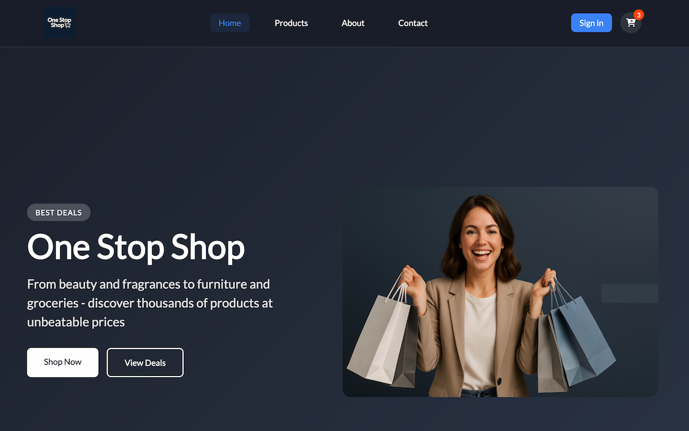

# Final Project: One Stop Shop



## Resources

### Netlify Deployment

[Live Project on Netlify](https://one-stop-shop-react.netlify.app/)

### GitHub Repository

[GitHub Repository Link](https://github.com/jerzyszajner/one-stop-shop.git)

## Getting Started

### Prerequisites

- Node.js (version 18+)
- npm
- Firebase account
- Cloudinary account

### Installation

```bash
git clone https://github.com/jerzyszajner/one-stop-shop.git
cd one-stop-shop
npm install
cp .env.example .env  # Fill in your Firebase and Cloudinary credentials
npm run dev
```

## Environment Variables

Create a `.env` file in the root directory:

```env
VITE_FIREBASE_API_KEY=your_firebase_api_key
VITE_FIREBASE_AUTH_DOMAIN=your_firebase_auth_domain
VITE_FIREBASE_PROJECT_ID=your_firebase_project_id
VITE_FIREBASE_STORAGE_BUCKET=your_firebase_storage_bucket
VITE_FIREBASE_MESSAGING_SENDER_ID=your_firebase_messaging_sender_id
VITE_FIREBASE_APP_ID=your_firebase_app_id
VITE_CLOUDINARY_NAME=your_cloudinary_cloud_name
```

## Technologies

- **React 19**
- **Vite**
- **React Router DOM**
- **Firebase**: (Authentication, Firestore, email verification, contact form storage)
- **Cloudinary**: (user avatar upload/storage)
- **FontAwesome**: (icons)
- **LocalStorage**: (cart persistence)
- **External API & Firestore**: (fetch products from DummyJSON and save to Firestore)
- **Responsive Design**: (desktop & mobile)

## Project Structure

```
src/
├── components/          # Reusable UI components
├── context/            # React Context providers (Auth & Cart)
├── hooks/              # Custom React hooks
├── pages/              # Page components
└── routes/             # Routing configuration
```

## Main Features

- **Product Import & Display**: Fetch product list from DummyJSON, store in Firestore, and display in a responsive grid.

- **Filtering & Sorting**: Filter by category, price, rating, stock, brand; sort by name, price, etc.

- **User Authentication & Profile**: Sign up/in with Firebase Auth, email verification, profile page shows user data and avatar (Cloudinary).

- **Contact Form**: Submit messages (name, email, phone, order number, subject, message) saved to Firestore.

- **Toast Notifications**: Global Toast component for success, error, warning, info messages with auto-hide and overlap handling.

- **RouteGuard**: Protects routes (/profile, /checkout, etc.) based on auth state, shows spinner while loading.

- **Cart & Checkout**: Cart state via Context API, persisted in LocalStorage; checkout saves orders under users/{uid}/orders in Firestore.

## Brief Description

One Stop Shop is an e-commerce application where users can:

- Browse products fetched from DummyJSON (stored in Firestore)
- Filter and sort items by category, price, rating, stock status, and brand
- Sign up and verify their email via Firebase Auth, upload a profile photo to Cloudinary, and view profile details
- Send messages through a contact form (saved to Firestore)
- Add products to a cart (state persisted in LocalStorage)
- Complete checkout with orders recorded in Firestore

## Credits

- **Inspiration**: School's Game Store App project – Kristinia Fagskole
- **API**: [DummyJSON](https://dummyjson.com/) – Free Fake REST API for placeholder JSON data
- **GPT/AI**: Generate images, icons and som text.

## Project Documentation

- [Project Documentation](docs/project-documentation.pdf)

## Figma Mockup

- [Figma Mockup](docs/one-stop-shop.fig)

## License

- MIT © Jerzy Szajner: [License.txt](License.txt)

## Contact

- [jerzy.szajner@gmail.com](mailto:jerzy.szajner@gmail.com)
- [LinkedIn](https://www.linkedin.com/in/jerzyszajner/)
